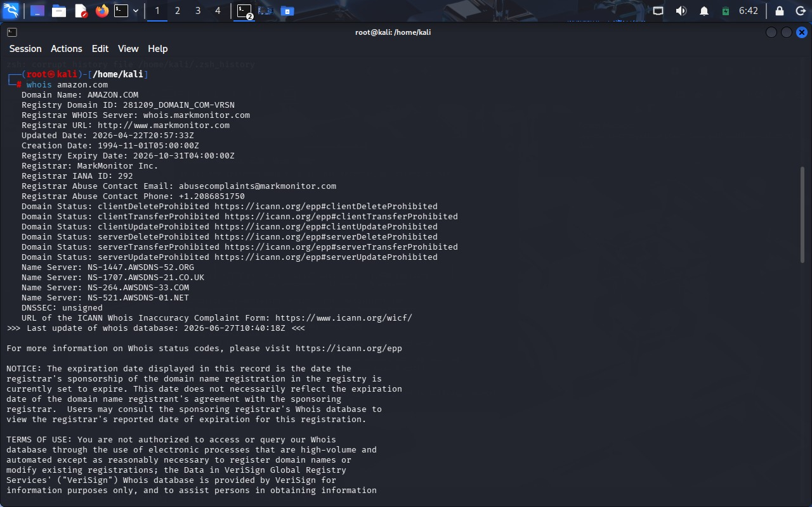
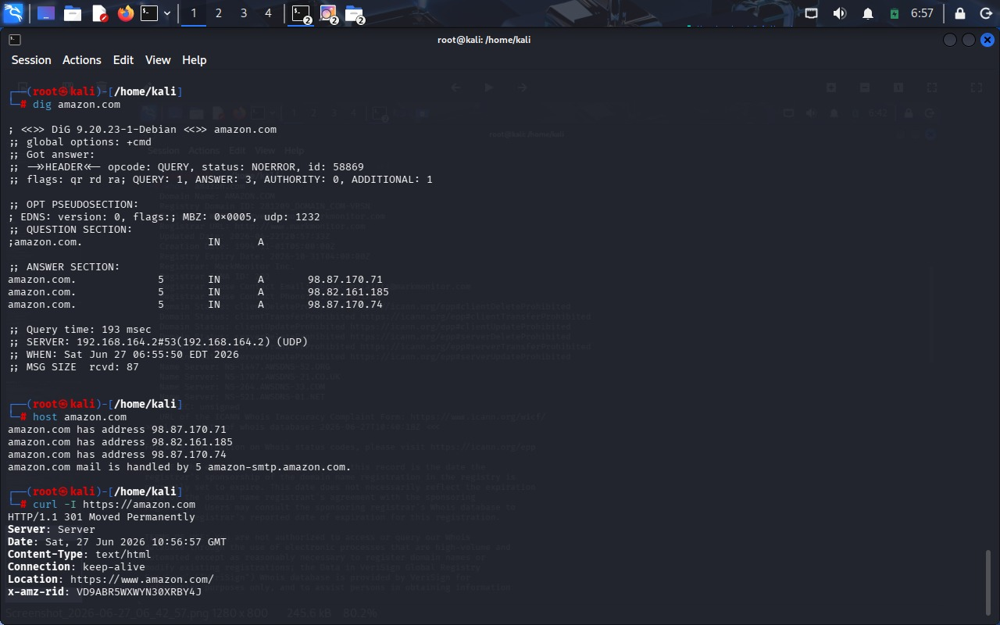

# Ethical Hacking Task 01
## Information Gathering & Reconnaissance

### Objective
Perform passive reconnaissance on a publicly accessible website using Kali Linux tools to collect publicly available information.

### Tools Used
- Kali Linux

### Commands Executed

whois amazon.com

dig amazon.com

dig NS amazon.com

dig MX amazon.com

host amazon.com

nslookup amazon.com

curl -I https://amazon.com

echo | openssl s_client -connect amazon.com:443 | openssl x509 -noout -dates -issuer -subject

### Files Included

README.txt
research_notes.txt
Screenshots

### Screenshots

### Learning Outcomes

- Understood the reconnaissance phase of ethical hacking.
- Learned how to perform passive information gathering.
- Collected domain registration details.
- Retrieved DNS information.
- Identified IP addresses and name servers.
- Examined HTTP response headers.
- Viewed SSL certificate information.
- Practiced ethical and legal reconnaissance techniques.

### Disclaimer

This project was completed strictly for educational purposes. Only publicly available information was collected from authorized public websites. No attempts were made to exploit, attack, or gain unauthorized access to any system.

### Author

### Name: Jenofenna Maria
